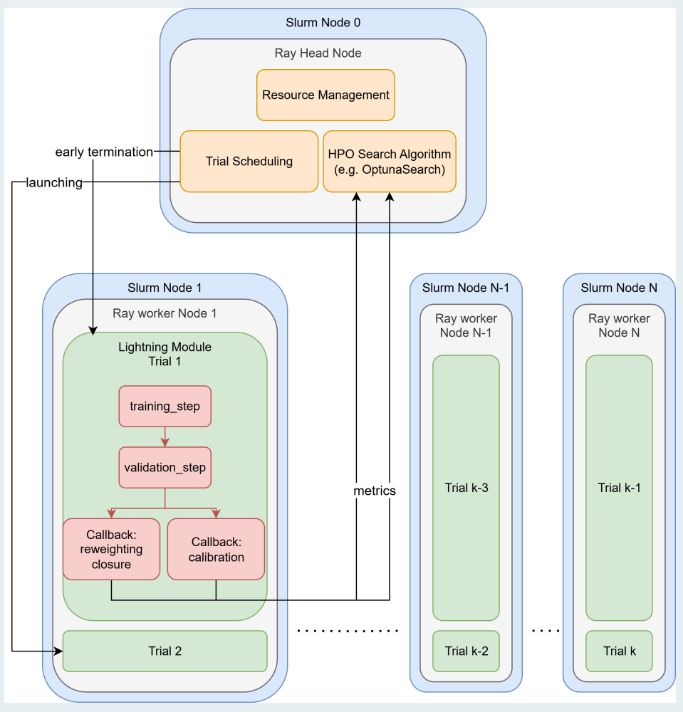

## Description
Machine Learning (ML) plays an important role in physics analysis in High Energy Physics. To achieve better physics performance, physicists are training larger and larger models with larger dataset. Therefore, many workflow developments focus on distributed training of large ML models, inventing techniques like model pipeline parallelism. However, not all physics analyses need to train large models. On the contrary, some emerging analysis techniques like OmniFold and Neural Simulation-Based Inference (NSBI) need to train thousands of small models to quantify systematic uncertainties. At the same time, each model undergoes hyperparameter optimization with constraints of physics performance. Similarly, ML-powered online hardware often favors small performant models for data compression and intelligent data filtering. Performing extensive automated model search is crucial for designing intelligent hardwares. They present a unique challenge for developing HPC workflows.

We will present a HPC-friendly workflow that simultaneously tackles the aforementioned challenges. The workflow will be applied to a realistic physics analysis for the NSBI analysis using the Perlmutter platform at NERSC.The workflow design and scaling of the workflow will be presented in detail.

