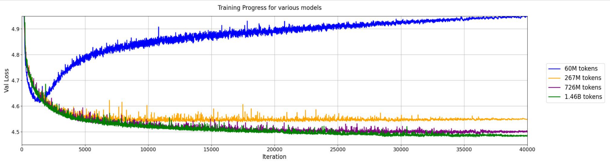

## Description
The simulation of particle interactions with detectors plays a critical role in understanding the detector performances and optimizing physics analysis. Without the guidance of the first-principle theory, the current state-of-the-art simulation tool, \textsc{Geant4}, exploits phenomenology-inspired parametric models, which must be combined and carefully tuned to experimental observations. The tuning process, even with the help of semi-auto tools like Professor, is laborious.

Generative language models showed outstanding performance in predicting the next tokens for a given prompt. Its capabilities in learning complex language patterns can be potentially leveraged to learn particle interactions from experimental data.

We introduce a Language Model-based framework for simulation particle detectors. In this framework, the particle information and detector hits will be tokenized into discrete numbers. And a transformer will be trained to learn the statistical correlations between the incoming particles and outgoing detector hits. Instead of directly predicting the detector hits, the transformer will predict the outgoing tokens, which then can be detokenized into detector hits. Our approach replaces the regression task with a multiclass classification task, which Transformers perform much better.

In addition to the introduction of a simulation framework, our contribution includes the introduction of a point cloud data-oriented particle tokenizer and a pre-trained GPT-like model for simulating particles interacting with detector materials.

