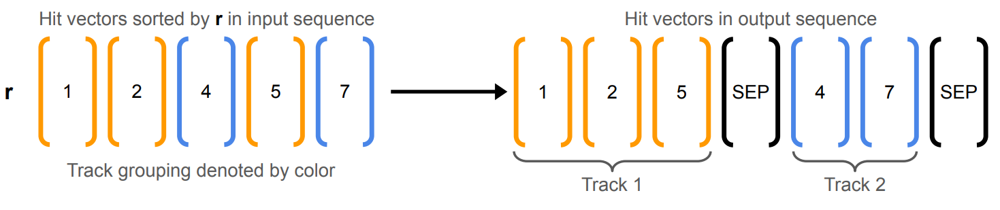

## Description
Building on the success of TrackingBERT (arXiv:2402.10239) and TrackingSorter (arXiv:2407.21290) , we propose a unified approach to address the track finding problem and extend beyond it. Our method integrates the latent representation of detector hits learned from TrackBERT as additional feastures in the TrackSorter algorithm.Furthermore, we replace the detector module ID-based tokenization scheme with a machine learning-driven scheme that better captures the spatial information. Results on the full-scale TrackML dataset will be presented, demonstrating improvements in both physics and computing performance. We also highlight the extensibility of this approach to simulate particle interactions with the detector and incorporating calorimeter data for holistic reconstruction.

